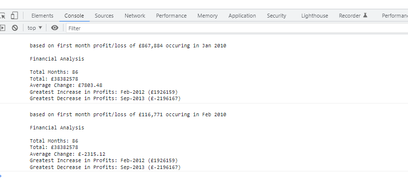

# Console-Finances
Module 4 Challenge - JavaScript Fundamentals

## Description:

This project was undertaken in order to improve my knowledge of Javascript utilising what I learnt in week 4 of the edx bootcamp. My aim was to take a 2D array, containing months and values, given to me in the starter code, and manipulate this array in order to log a range of outputs to the console.

## Table of contents
- [Notes](#notes)
- [Installation](#installation)
- [Usage](#usage)
- [Credits](#credits)
- [License](#license)

## Notes
Please note that there was some confusion amongst the class, including from the TA's and the class instructor, as to what was meant by "average of the changes" and also as to what month the first "change" occured. 

I firstly assumed that the first change in profit and loss, occured in Jan 2010, and was equal to that months profit/loss. This resulted in an average of the changes 

I then solved based on the assumption that the first change in profit and loss was equal to the difference between Feb 2010 and Jan 2010 and hence, occured in Feb 2010. This results in a much lower average chage as can be seen from the result. 

Hopefully this is clear in the 2 answers I have provided. 

I have also interpreted 'Greatest Increase/ Decrease in profits' to mean the greatest change from month to month.

## Installation
n/a 

## Usage
Open Web page and open the console in dev tools to see the results. 

Link to [Live-Page](https://jxg052.github.io/Console-Finances/)

## Credits

Thanks to edx bootcamp team for providing starter code and mockup. 

## License

MIT License

Copyright (c) 2022 JXG052
